# 🤖 AI-Powered n8n Automation Suite: Content Curation, Job Hunting & Social Media Curation

A comprehensive suite of twelve production-grade, enterprise-ready **n8n** automation workflows powered by **Google Gemini** LLMs. These workflows are designed to automate personal branding, professional career operations, email news curation, API event tracking, history content publication, and job pipeline management.

Every workflow is fully generalized, safe for public distribution, and sanitized of all specific API Keys, personal emails, credential IDs, or spreadsheet locations. Import them directly into n8n, authenticate your credentials, and start automating immediately.

---

## 📂 Repository Contents

| Workflow File | Purpose | Trigger Source | Core Integrations |
| :--- | :--- | :--- | :--- |
| [`Auto Learning Journey Publisher.json`](./Auto%20Learning%20Journey%20Publisher.json) | Converts learning logs into structured LinkedIn updates and punchy X posts. | **Google Sheets** (every minute) | Google Gemini, LinkedIn API, Twitter/X API |
| [`Automated Social Media Content Generation.json`](./Automated%20Social%20Media%20Content%20Generation.json) | Curates and drafts insights for articles/links into social media updates. | **Google Sheets** (every hour) | Google Gemini, LinkedIn API, Twitter/X API |
| [`AI News Summarizer.json`](./AI%20News%20Summarizer.json) | Aggregates multiple RSS tech feeds into an AI-categorized morning briefing. | **Schedule Trigger** (Daily) | RSS Feeds, Google Gemini, Gmail API |
| [`Auto AI Internship Applier.json`](./Auto%20AI%20Internship%20Applier.json) | Reads open positions from a spreadsheet and drafts/sends structured cover letters. | **Google Sheets** (New Row) | Google Gemini, Structured JSON Parser, Gmail API |
| [`Automated LinkedIn Job Tracker with N8N.json`](./Automated%20LinkedIn%20Job%20Tracker%20with%20N8N.json) | Monitors LinkedIn job search RSS feeds, extracts skills, and drafts custom cover letters. | **Schedule Trigger** (Daily) | RSS Feeds, Google Gemini, Google Sheets API |
| [`AI News Summarizer Part 2.json`](./AI%20News%20Summarizer%20Part%202.json) | Combines RSS Feeds and SerpAPI Google News search query outputs into an expanded newsletter. | **Schedule Trigger** (Daily) | RSS Feeds, SerpAPI HTTP Node, Google Gemini, Gmail |
| [`Automated Historical Content Publisher.json`](./Automated%20Historical%20Content%20Publisher.json) | Automatically discovers historical facts based on the current date, writes structured LinkedIn posts, and publishes them. | **Schedule Trigger** (Daily) | Google Gemini, LinkedIn API |
| [`Automated Social Media Content Generation with Image.json`](./Automated%20Social%20Media%20Content%20Generation%20with%20Image.json) | Curates insights for links, drafts professional posts, generates AI graphics via Replicate, and posts to LinkedIn with media. | **Google Sheets** (New Row) | Google Sheets, Google Gemini, Replicate API, LinkedIn API |
| [`AI Podcast Generator.json`](./AI%20Podcast%20Generator.json) | Generates a 2-minute spoken podcast script on a given topic, synthesizes it into natural speech via Murf AI, and downloads the podcast WAV file. | **Chat Trigger** (User Input) | Google Gemini, Murf AI HTTP Node |
| [`AI Audio Summarization and Speech Generation.json`](./AI%20Audio%20Summarization%20and%20Speech%20Generation.json) | Downloads audio input from chat, transcribes it via Groq Whisper, creates meeting-style minutes via Gemini, and synthesizes it to speech via Murf AI. | **Chat Trigger** (User Audio URL) | Groq Whisper Node, Google Gemini, Murf AI Node |
| [`Automated Song Generation.json`](./Automated%20Song%20Generation.json) | Generates song lyrics on a given topic, generates audio tracks via Suno AI API, and downloads the finalized song file. | **Chat Trigger** (User Input) | Google Gemini, Suno AI HTTP Node |
| [`AI Podcast Generator with Webhooks.json`](./AI%20Podcast%20Generator%20with%20Webhooks.json) | Listens for incoming webhook requests containing podcast topics, drafts scripts via Gemini, synthesizes them into speech via Murf AI, and sends back audio. | **Webhook Trigger** (POST Request) | Google Gemini, Murf AI HTTP Node, Webhook Node |

---

## ⚡ Detailed Workflow Breakdowns

### 1. Auto Learning Journey Publisher
Monitors your learning entries, summarizes raw study notes, and generates platform-specific professional updates.

* **Trigger**: Google Sheets (polls every minute).
* **AI Logic**: Extracts topics and achievements, generates a detailed LinkedIn update with tags, and creates an enthusiastically punchy tweet under 280 characters.
* **Flow**:
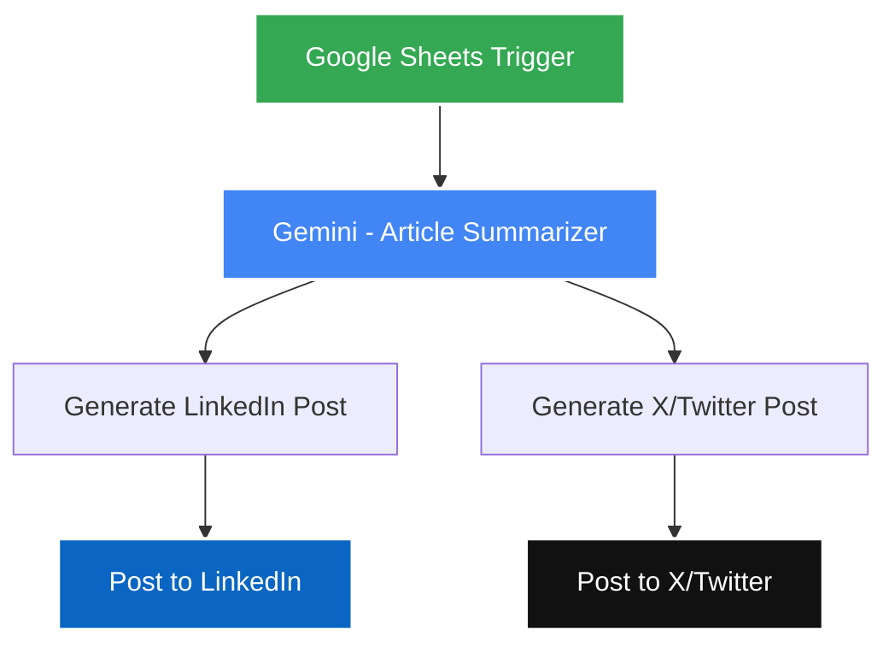

### 2. Automated Social Media Content Generation
Acts as a thought-leadership generator. Evaluates raw articles or developer blogs, synthesizes implications, and schedules updates.

* **Trigger**: Google Sheets (polls every hour).
* **AI Logic**: Summarizes article text, produces structural LinkedIn updates containing professional CTAs, and crafts short, high-impact tweets (within 30 words).
* **Flow**:
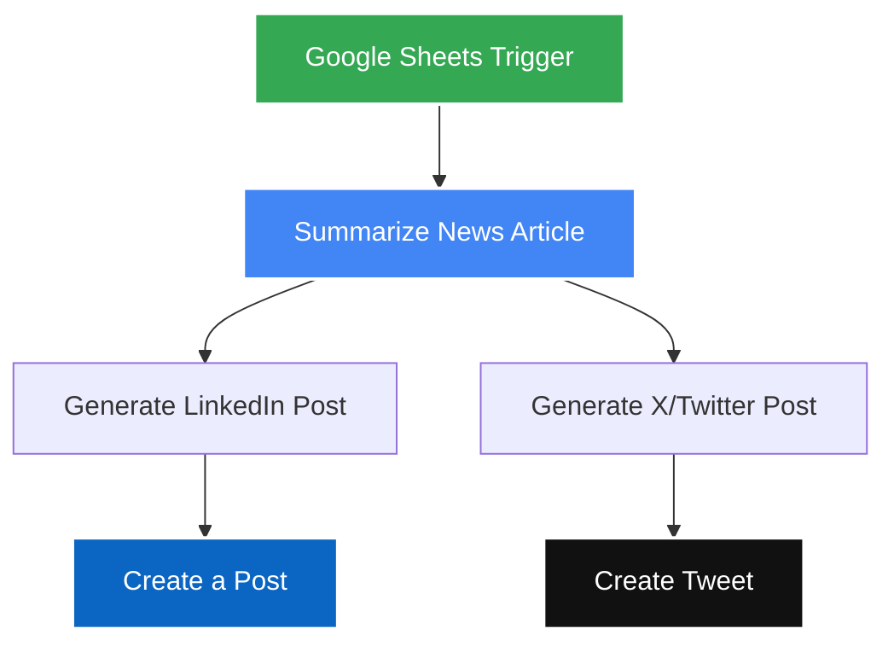

### 3. AI News Summarizer
Aggregates news items from multiple RSS tech portals, consolidates them, and feeds them into Gemini to build a beautifully structured morning briefing.

* **Trigger**: Cron/Schedule (runs daily at 10:00 AM).
* **AI Logic**: Merges feeds from diverse sources, filters articles, sorts them by headings (`AI NEWS`, `TECHNOLOGY UPDATES`), and highlights 3 items per section.
* **Flow**:
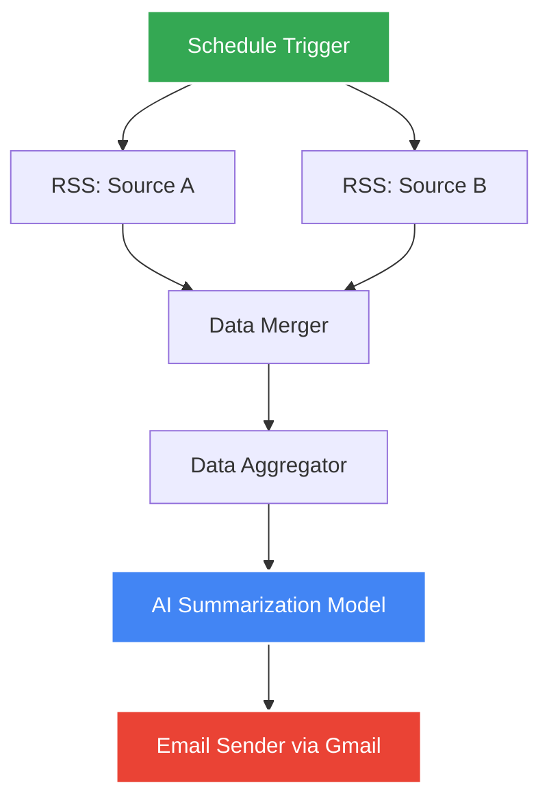

### 4. Auto AI Internship Applier
Automates the initial outreach stage for internship applications by reviewing open pipeline spreadsheets and drafting personalized introduction letters.

* **Trigger**: Google Sheets (new application row appended).
* **AI Logic**: Evaluates role, company, student's details, and experience. Leverages a LangChain **Structured Output Parser** to format the output as strict JSON schema containing `{to, subject, body}`.
* **Flow**:
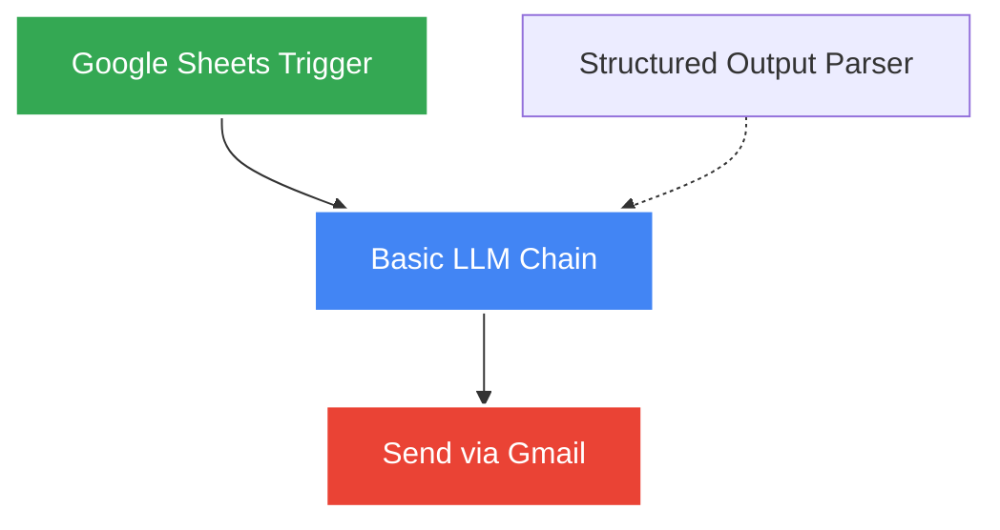

### 5. Automated LinkedIn Job Tracker
Scrapes targeted job search feeds, parses specifications, identifies critical programming/architectural requirements, generates professional matching cover letters, and appends them to your tracking dashboard.

* **Trigger**: Cron/Schedule (runs daily at 1:00 AM).
* **AI Logic**: Consumes feed details, extracts specific technical requirements into list arrays, writes a cover letter, and updates your sheet records.
* **Flow**:
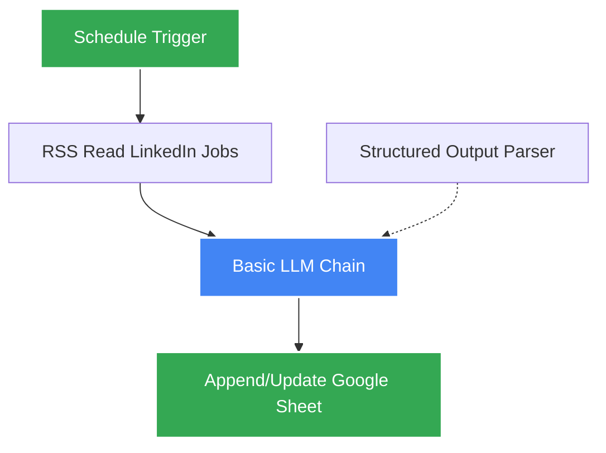

### 6. AI News Summarizer Part 2
An advanced, multi-source compilation pipeline. Simultaneously monitors custom technology RSS Feeds and queries Google News via a custom SerpAPI HTTP request to dynamically consolidate tech, development, and upcoming event schedules into one daily intelligence digest.

* **Trigger**: Cron/Schedule (runs daily at 12:00 PM).
* **AI Logic**: Pulls RSS nodes and runs a custom Google News search query utilizing SerpAPI. Merges three separate inputs, aggregates data, and uses a Gemini 2.5 Flash chat model to draft comprehensive summaries and schedule lists.
* **Flow**:
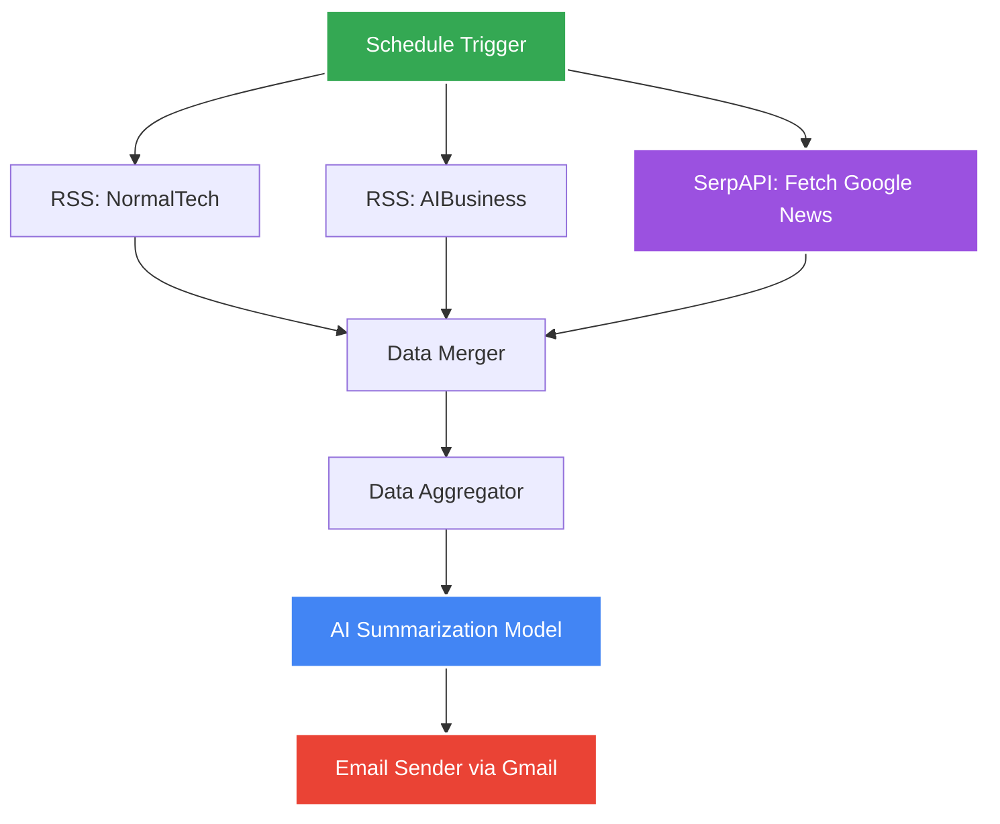

### 7. Automated Historical Content Publisher
Automatically tracks the current calendar date, prompts Gemini to find a compelling, historically significant event that occurred "on this day", formats a professional, high-engagement story layout with discussion prompts and hashtags, and publishes it to your LinkedIn feed.

* **Trigger**: Cron/Schedule (runs daily at 12:00 PM).
* **AI Logic**: Obtains today's date dynamically (`{{ $now.toFormat('MMMM d') }}`), writes a custom prompt template, processes the data through Gemini 2.5 Flash, and publishes to the LinkedIn API.
* **Flow**:
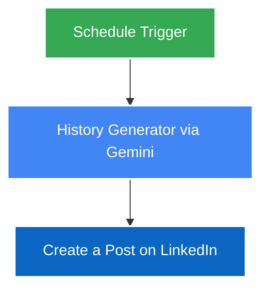

### 8. Automated Social Media Content Generation with Image
An advanced branding and thought-leadership creation agent. Consumes article links, summarizes their content, generates a professional LinkedIn writeup, prompts an image generation model on Replicate (Flux 2 Pro) to produce a matching high-quality visual, downloads the resulting graphic, and publishes a media post directly to LinkedIn.

* **Trigger**: Google Sheets (new row containing article link).
* **AI Logic**: 
  - Summarizes the source article text.
  - Drafts an analytical LinkedIn post under 3,000 characters.
  - Designs a visual prompt under 50 words tailored for modern technology/business visuals.
  - Submits predictions via Replicate API, polls for status, downloads the media, and publishes to LinkedIn.
* **Flow**:
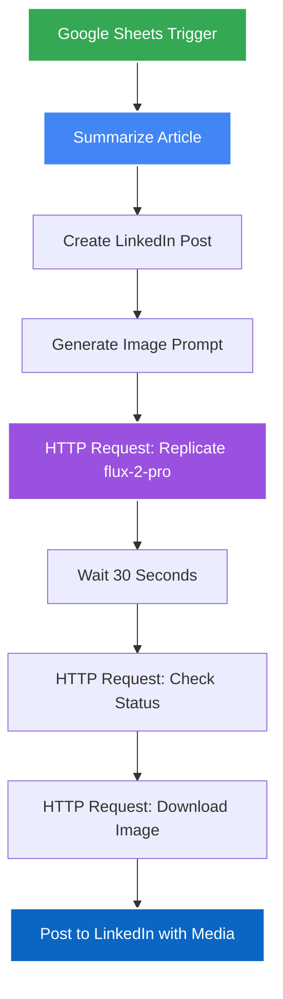

### 9. AI Podcast Generator
A custom voice production pipeline. Receives a text topic query through an interactive n8n chat trigger interface, generates a natural, highly engaging 2-minute podcast script via Gemini 2.5 Flash, submits the resulting content to the Murf AI text-to-speech API (utilizing high-fidelity professional voice models), and fetches the processed high-quality WAV audio file for download.

* **Trigger**: Chat Trigger (on receiving user message query).
* **AI Logic**: 
  - Standardizes the chat trigger parameters.
  - Passes the input query topic to Gemini 2.5 Flash to write a 2-minute voice script without markdown tags.
  - Submits a stream-synthesis request to Murf AI's voice server (locale: `en-US`, voice model: `Charles`, model: `FALCON`).
  - Automatically streams and saves the downloadable podcast media file.
* **Flow**:
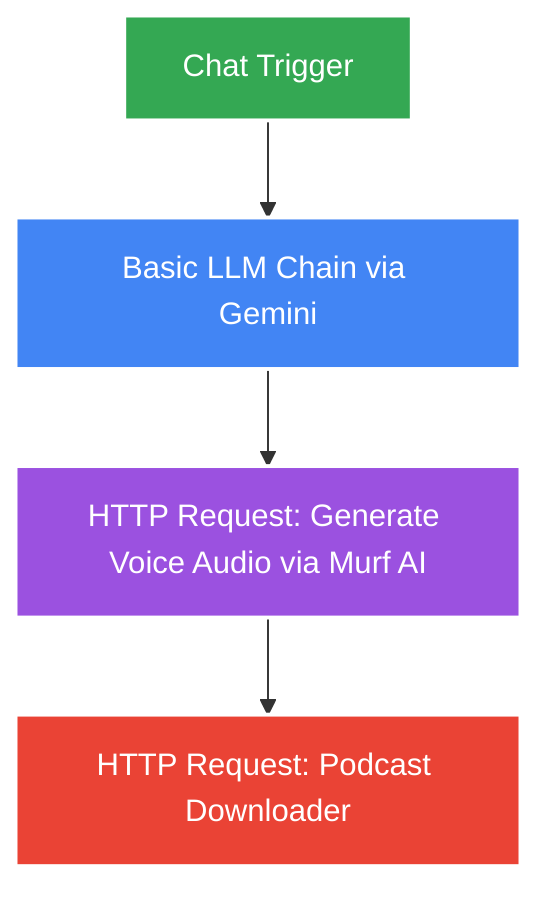

### 10. AI Audio Summarization and Speech Generation
A high-performance voice-to-text-to-voice media processing agent. Takes an audio URL provided through an n8n chat trigger interface, downloads the audio file, transcribes it using Groq's high-speed **Whisper Large V3 Turbo** model, processes the raw transcription into highly structured meeting minutes using Gemini 2.5 Flash Lite (following strict formatting and concise phrasing rules), and synthesizes the finalized minutes back into a professional spoken WAV audio file via Murf AI's voice synthesis engine.

* **Trigger**: Chat Trigger (on receiving user message query containing audio file URL).
* **AI Logic**: 
  - Downloads the source audio file from the user's input URL.
  - Transcribes the audio file via Groq Whisper API node (`whisper-large-v3-turbo`).
  - Summarizes the transcription into clear meeting minutes using Gemini 2.5 Flash Lite.
  - Submits the bulleted minutes to Murf AI for high-fidelity speech synthesis, returning a downloadable WAV podcast file.
* **Flow**:
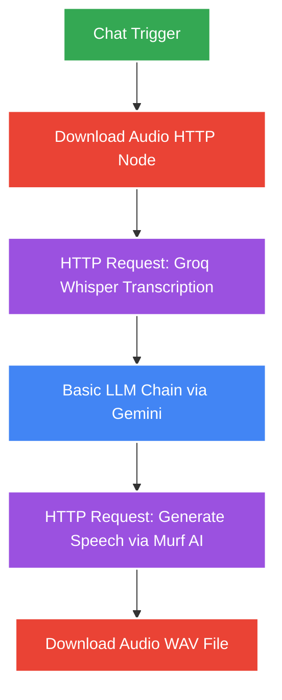

### 11. Automated Song Generation
An AI music generation pipeline. Receives a user's song request/style query through an interactive n8n chat trigger interface, generates creative and structured song lyrics (verses, chorus, bridge) using Gemini 2.5 Flash Lite, submits a custom music generation task to the Suno AI API, waits for the track synthesis to finish, queries for compilation progress, and downloads the finalized high-quality audio song track.

* **Trigger**: Chat Trigger (on receiving user message query containing song theme/style instructions).
* **AI Logic**: 
  - Standardizes song parameters from chat query input.
  - Generates lyrics via Gemini 2.5 Flash Lite based on custom formatting rules.
  - Submits a custom mode creation request to the Suno AI generation model (`V4_5ALL`).
  - Waits for track generation, retrieves record data, and automatically downloads the synthesized audio track file.
* **Flow**:
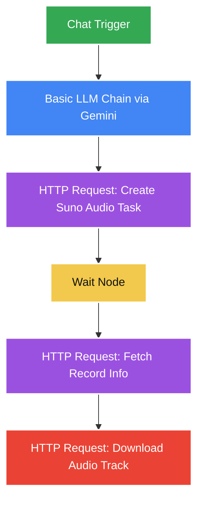

### 12. AI Podcast Generator with Webhooks
An event-driven audio production service. Exposes a secure POST webhook endpoint receiving topic parameters, writes an elegant, informative podcast script using Gemini 2.5 Flash, processes the script text into natural voice audio via Murf AI's high-fidelity voice stream synthesis, and returns the synthesized high-quality WAV audio binary directly as the webhook HTTP response.

* **Trigger**: Webhook Trigger (exposed POST endpoint responding with the audio stream).
* **AI Logic**: 
  - Standardizes parameters from the incoming webhook payload.
  - Generates a raw voice script with Gemini 2.5 Flash based on the request topic.
  - Requests voice synthesis from Murf AI (`voiceId`: `Charles`, `model`: `FALCON`), streaming the WAV content directly back to the webhook sender.
* **Flow**:
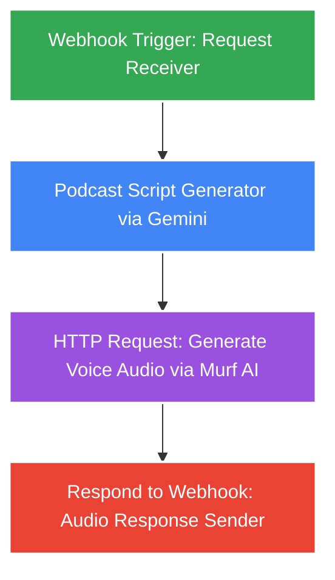

---

## 📊 Database & Spreadsheet Schemas

For workflows that sync with Google Sheets, ensure your target worksheets are configured with the exact columns below:

### Workflow: `Auto Learning Journey Publisher`
* **Sheet Name**: `Sheet1`
* **Required Headers**: `Date` | `Topic/Module` | `What I Learned` | `Skills/Tools`

### Workflow: `Automated Social Media Content Generation`
* **Sheet Name**: `Sheet1`
* **Required Headers**: `text` | `Article Links`

### Workflow: `Auto AI Internship Applier`
* **Sheet Name**: `Sheet1`
* **Required Headers**: `Full Name` | `Email` | `Position Applied` | `Details` | `Experience (Years)` | `Skills`

### Workflow: `Automated LinkedIn Job Tracker`
* **Sheet Name**: `Sheet1`
* **Required Headers**: `Title` | `Link` | `Published Date` | `About Company and job description` | `skills` | `cover letter`

### Workflow: `Automated Social Media Content Generation with Image`
* **Sheet Name**: `Sheet1`
* **Required Headers**: `newslink`

---

## 🛠️ Step-by-Step Deployment & Configuration

### Step 1: Import the Workflow
1. Log into your **n8n** instance.
2. In the left navigation, click on **Workflows** -> **Add Workflow** -> **Import from File**.
3. Choose one of the JSON files from this repository.
4. Click **Import**.

### Step 2: Configure Credentials
Set up credentials inside n8n for any integrations utilized by your imported workflow:

1. **Google Gemini API**: Create an API Key inside [Google AI Studio](https://aistudio.google.com/). Add a **Google Gemini(PaLM) API** connection in n8n.
2. **Google Sheets / Gmail API (OAuth2)**: Create a project on the [Google Cloud Console](https://console.cloud.google.com/), enable the target APIs, generate **OAuth 2.0 Client IDs**, and link them in n8n.
3. **LinkedIn OAuth2 API**: Register an app on the [LinkedIn Developer Portal](https://developer.linkedin.com/), enable sharing capabilities, and link via OAuth2.
4. **Twitter/X API**: Register your app on the [X Developer Portal](https://developer.x.com/) with **Read/Write** access, and configure user context connections.
5. **SerpAPI (If using Summarizer Part 2)**: Register an account at [SerpAPI](https://serpapi.com/) and obtain a free API key.
6. **Replicate API (If using Social Media Content with Image)**: Create an account on [Replicate](https://replicate.com/), generate an API token, and input `Token YOUR_REPLICATE_API_TOKEN` in the `Authorization` headers of both HTTP request nodes.
7. **Murf AI API (If using AI Podcast Generator or AI Podcast Generator with Webhooks)**: Register an account on [Murf AI](https://murf.ai/), generate an API key, and configure `api-key` in the headers parameter of the HTTP node with `YOUR_MURF_API_KEY`.
8. **Groq API (If using AI Audio Summarization and Speech Generation)**: Create an API Key on the [Groq Console](https://console.groq.com/), and input `Bearer YOUR_GROQ_API_KEY` in the `Authorization` header of the transcription HTTP request node.
9. **Suno AI API (If using Automated Song Generation)**: Sign up on the [Suno API portal](https://sunoapi.org/), obtain an API token, and input `Bearer YOUR_SUNO_API_TOKEN` in the `Authorization` header of both Suno HTTP nodes.

### Step 3: Link Your Resources
1. Create a spreadsheet in your Google Drive matching the matching column layout.
2. Copy the spreadsheet's ID from its URL.
3. Open the spreadsheet trigger/append nodes, replace `YOUR_SPREADSHEET_ID` in the **Document ID** parameter with your custom ID, and select the correct **Sheet Name**.
4. In workflows that use custom RSS feeds (Job Tracker / News Summarizer), replace `YOUR_LINKEDIN_JOBS_RSS_FEED_URL` with your feed's URL.
5. In email sender nodes, replace `YOUR_EMAIL@gmail.com` with your delivery address.
6. In `AI News Summarizer Part 2.json`, open the `Fetch Events` HTTP node and replace the query parameter value `YOUR_SERPAPI_API_KEY` with your SerpAPI key.
7. In `Automated Historical Content Publisher.json` and any other LinkedIn-enabled workflow, open the `Create a post` node and link your personal profile so `YOUR_LINKEDIN_PERSON_ID` is mapped to your member profile.
8. In `Automated Social Media Content Generation with Image.json`, replace the hardcoded Replicate prediction tokens in both HTTP Request nodes with `Token YOUR_REPLICATE_API_TOKEN`.
9. In `AI Podcast Generator.json`, replace the hardcoded Murf AI key in the HTTP Request header parameters with `YOUR_MURF_API_KEY`.
10. In `AI Audio Summarization and Speech Generation.json`, replace the hardcoded Groq API key with `Bearer YOUR_GROQ_API_KEY` and the Murf AI key with `YOUR_MURF_API_KEY` in their respective HTTP Request header parameters.
11. In `Automated Song Generation.json`, replace the hardcoded Suno API key in both HTTP Request header parameters with `Bearer YOUR_SUNO_API_TOKEN`.
12. In `AI Podcast Generator with Webhooks.json`, replace the hardcoded Murf AI key in the HTTP Request header parameters with `YOUR_MURF_API_KEY` and define a custom `YOUR_WEBHOOK_PATH` in the Webhook node.

---

## 🔒 Security Best Practices

> [!IMPORTANT]
> **Zero Credential Sharing**
> 
> * These exported `.json` workflows **do not** contain any active auth accounts, passwords, or client secrets. n8n isolates all credentials in an encrypted internal database and references them using internal placeholders (e.g., `credentials-uuid-here`).
> * Any required raw API query strings or headers (e.g., SerpAPI keys, Replicate API tokens, Murf AI API keys, Groq API keys, Suno API tokens) or LinkedIn Member IDs are generalized as placeholders (`YOUR_SERPAPI_API_KEY`, `YOUR_REPLICATE_API_TOKEN`, `YOUR_MURF_API_KEY`, `YOUR_GROQ_API_KEY`, `YOUR_SUNO_API_TOKEN`, `YOUR_LINKEDIN_PERSON_ID`).
> * Ensure your spreadsheet data files and local environment configuration sheets are ignored via the active `.gitignore`.

---

## 📄 License
This repository is open-source and available under the [MIT License](LICENSE).
