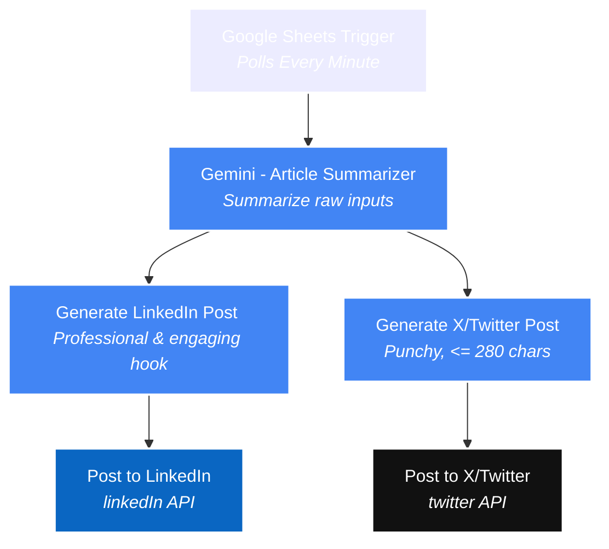
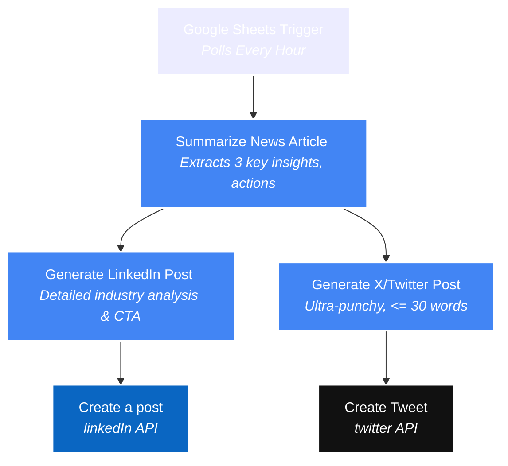

# 🤖 AI-Powered Social Media & Learning Journey Automation with n8n

An enterprise-ready, fully automated orchestration suite built on **n8n** that leverages **Google Gemini** LLMs to seamlessly convert Google Sheets data into high-performing, platforms-tailored social media content for **LinkedIn** and **X (formerly Twitter)**.

Whether you want to document your daily coding journey or programmatically scale an AI-focused news curation channel, this repository provides plug-and-play workflows to automate your personal branding and content strategy.

---

## 📂 Repository Contents

This repository hosts two distinct, production-grade n8n workflows designed to scale content generation using the modern LangChain node ecosystem:

| Workflow File | Purpose | Trigger Source | Core Integrations |
| :--- | :--- | :--- | :--- |
| [`Auto Learning Journey Publisher.json`](./Auto%20Learning%20Journey%20Publisher.json) | Converts learning progress logs into structured LinkedIn and punchy X posts. | **Google Sheets** (every minute) | Google Gemini, LinkedIn API, Twitter/X API |
| [`Automated Social Media Content Generation.json`](./Automated%20Social%20Media%20Content%20Generation.json) | Summarizes industry-specific articles/links, drafts insights, and schedules posts. | **Google Sheets** (every hour) | Google Gemini, LinkedIn API, Twitter/X API |

---

## ⚡ Workflow Breakdown & Architecture

### 1. Auto Learning Journey Publisher
**File:** `Auto Learning Journey Publisher.json`

This workflow is optimized for builders, students, and engineers participating in challenges like **#100DaysOfCode** or tracking their professional growth. It polls a tracking sheet, summarizes raw learning notes, and constructs platform-specific narratives.

#### 🏗️ Architecture Flow

#### 📊 Google Sheet Schema
To run this workflow, your target Google Sheet **must** contain a worksheet with the following header names (Case Sensitive):

| Column Name | Type | Description / Example |
| :--- | :--- | :--- |
| `Date` | Date | `2026-05-26` |
| `Topic/Module` | Text | `Retrieval-Augmented Generation (RAG) Architecture` |
| `What I Learned` | Text | `Explored semantic search vs keyword search, set up vector embeddings utilizing Google Gemini Embeddings, and configured a vector DB pipeline.` |
| `Skills/Tools` | Text | `Python, LangChain, Qdrant, Vector Embeddings` |

---

### 2. Automated Social Media Content Generation
**File:** `Automated Social Media Content Generation.json`

This workflow serves as a programmatic **News Curator**. It monitors a spreadsheet containing articles and raw links, leverages Gemini to perform an advanced multi-perspective summary, and produces professional thought-leadership posts.

#### 🏗️ Architecture Flow

#### 📊 Google Sheet Schema
To run this workflow, configure your target Google Sheet with these columns:

| Column Name | Type | Description / Example |
| :--- | :--- | :--- |
| `text` | Text | Raw content of the article or developer blog post. |
| `Article Links` | URL | Link to original source (e.g., `https://deepmind.google/blog/...`). |

---

## 🛠️ Step-by-Step Setup Guide

Follow these steps to deploy and run these workflows inside your n8n instance:

### Step 1: Import the Workflows
1. Log into your **n8n** instance.
2. In the left navigation, click on **Workflows** -> **Add Workflow** -> **Import from File**.
3. Select one of the JSON files from this repository (e.g., `Auto Learning Journey Publisher.json`).
4. Click **Import**.

### Step 2: Configure Credentials
These workflows leverage specific external APIs. You must set up and link credentials inside n8n:

1. **Google Gemini (PaLM) API**:
   - Go to [Google AI Studio](https://aistudio.google.com/).
   - Generate a new **API Key**.
   - In n8n, create a new credential for **Google Gemini(PaLM) API** and paste your API key.
2. **Google Sheets OAuth2 API**:
   - Create a project on the [Google Cloud Console](https://console.cloud.google.com/).
   - Enable the **Google Sheets API** and **Google Drive API**.
   - Configure your **OAuth Consent Screen** and create **OAuth 2.0 Client IDs**.
   - Create a Google Sheets credential in n8n and link it using the client ID and secret.
3. **LinkedIn OAuth2 API**:
   - Register an application on the [LinkedIn Developer Portal](https://developer.linkedin.com/).
   - Add the **Share on LinkedIn** and **Sign In with LinkedIn** products/permissions.
   - Configure the Redirect URI provided by n8n.
   - Create and link the credential in n8n.
4. **Twitter/X API**:
   - Register an application on the [X Developer Portal](https://developer.x.com/).
   - Enable **Read and Write** permissions.
   - Generate your **OAuth 2.0 User Context** keys (Client ID and Client Secret) or OAuth 1.0a credentials.
   - Set up the **Twitter / X** node credentials in n8n.

### Step 3: Link Your Google Sheet
1. Create a spreadsheet in Google Drive matching the column schemas described above.
2. Copy the **Spreadsheet ID** from the URL:
   `https://docs.google.com/spreadsheets/d/[SPREADSHEET_ID_IS_HERE]/edit`
3. In both the `Google Sheets Trigger` node and any other sheet referencing nodes, replace the `Document ID` field with your own **Spreadsheet ID**.
4. Select your target **Sheet Name** (e.g., `Sheet1`).

### Step 4: Test & Activate
1. Click **Listen for Test Event** on the Google Sheets Trigger.
2. Add a new row to your Google Sheet.
3. Verify the execution flow and inspect the generated posts in the node output.
4. If everything looks perfect, toggle the workflow status from **Inactive** to **Active** in the top right corner.

---

## 🎨 Prompt Customization & Tweaking

You can easily tweak the AI tone, formatting, and parameters to match your personal brand or project needs:

* **To adjust LinkedIn post formatting**: Open the `Generate LinkedIn Post Content` node and modify the text template. You can add default hashtags, mandate specific structures (e.g. key bullet points, custom CTAs), or specify formatting constraints.
* **To adjust X/Twitter limits**: Open the `Generate X/Twitter PostContent` node. By default, it uses prompt templates designed to force the LLM to output content under 280 characters or under 30 words.
* **To change the model version**: The LLM Chat node (`@n8n/n8n-nodes-langchain.lmChatGoogleGemini`) is currently set to `models/gemini-3-flash-preview`. You can change this to standard stable models like `gemini-1.5-flash` or `gemini-1.5-pro` directly in the dropdown menu.

---

## 🔒 Security Best Practices

> [!WARNING]
> **API Key and Credential Safety First!**
> 
> * **Never edit or insert** raw credentials, API keys, or oauth client secrets directly into the `.json` files. 
> * n8n securely isolates credentials inside its own encrypted internal database, referencing them inside the JSON export using abstract system IDs (like `lb0aceovIRBjmc7K`).
> * Ensure your `.gitignore` file excludes any temporary sheet backups or API configurations that could accidentally expose environment variables.

---

## 📄 License
This repository is open-source and available under the [MIT License](LICENSE).
