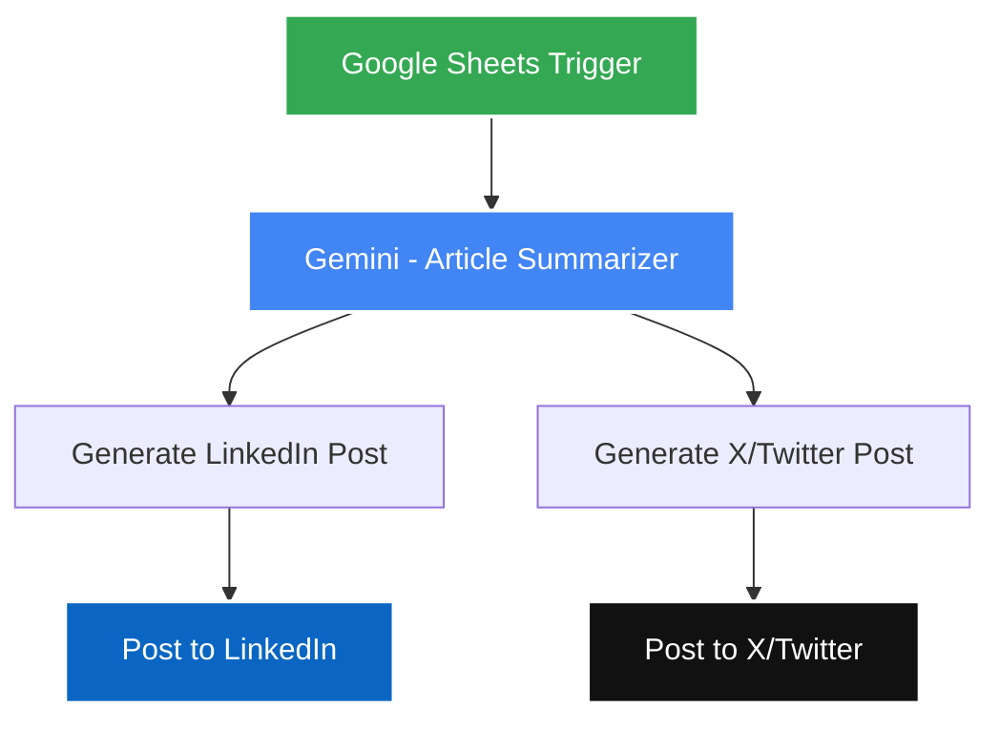
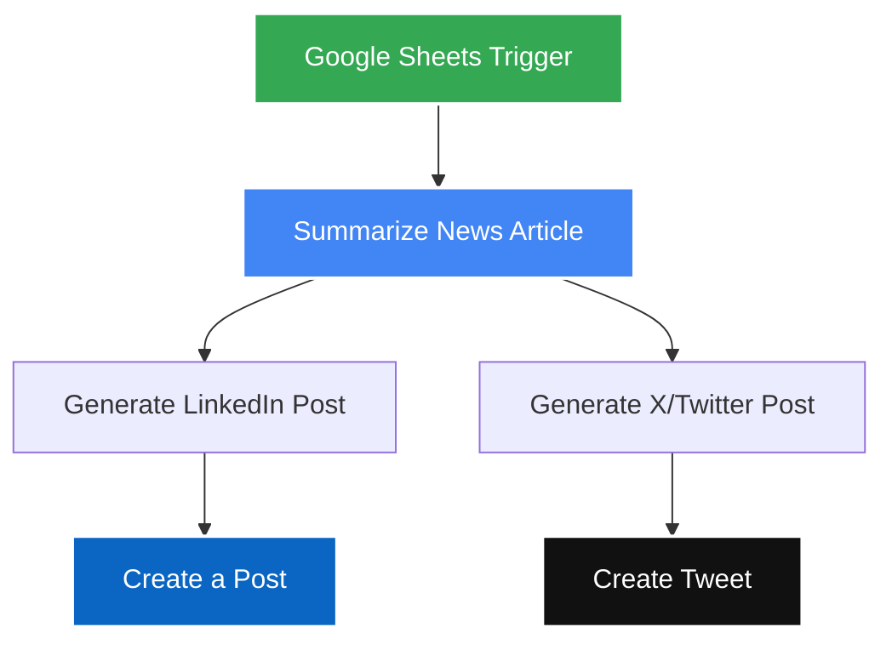
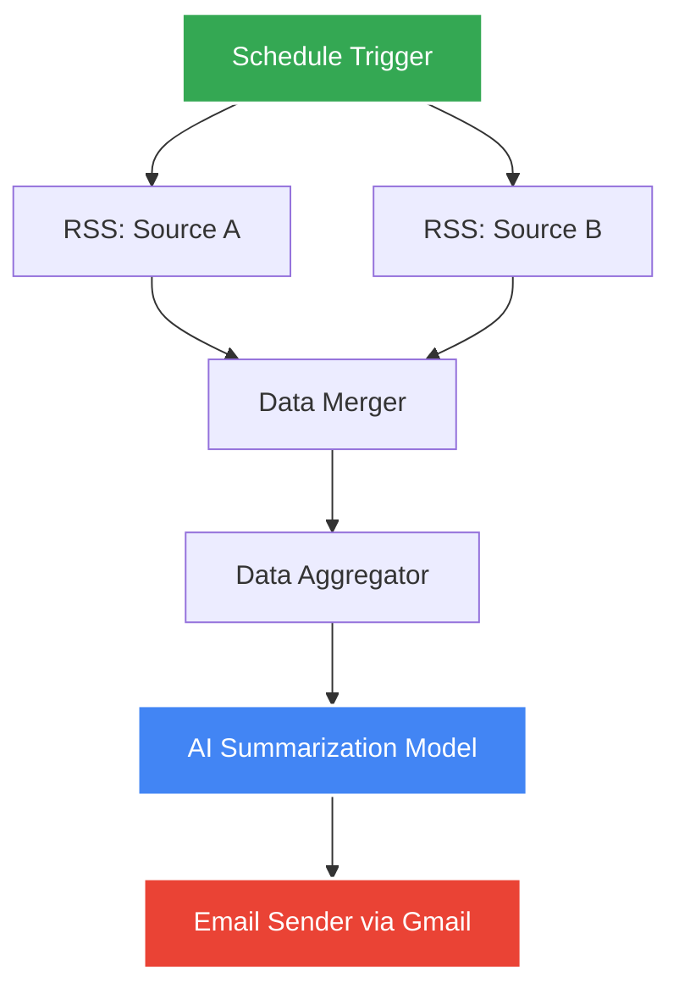
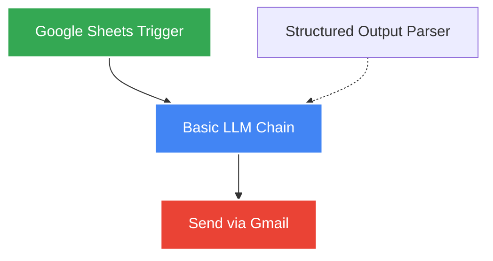
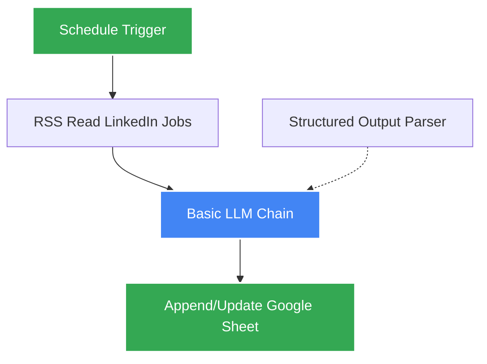

# 🤖 AI-Powered n8n Automation Suite: Content Curation, Job Hunting & Social Media Curation

A comprehensive suite of five production-grade, enterprise-ready **n8n** automation workflows powered by **Google Gemini** LLMs. These workflows are designed to automate personal branding, professional career operations, email curation, and job pipeline management.

Every workflow is fully generalized, safe for public distribution, and sanitized of all specific credential IDs or spreadsheet locations. Import them directly into n8n, authenticate your credentials, and start automating immediately.

---

## 📂 Repository Contents

| Workflow File | Purpose | Trigger Source | Core Integrations |
| :--- | :--- | :--- | :--- |
| [`Auto Learning Journey Publisher.json`](./Auto%20Learning%20Journey%20Publisher.json) | Converts learning logs into structured LinkedIn updates and punchy X posts. | **Google Sheets** (every minute) | Google Gemini, LinkedIn API, Twitter/X API |
| [`Automated Social Media Content Generation.json`](./Automated%20Social%20Media%20Content%20Generation.json) | Curates and drafts insights for articles/links into social media updates. | **Google Sheets** (every hour) | Google Gemini, LinkedIn API, Twitter/X API |
| [`AI News Summarizer.json`](./AI%20News%20Summarizer.json) | Aggregates multiple RSS tech feeds into an AI-categorized morning briefing. | **Schedule Trigger** (Daily) | RSS Feeds, Google Gemini, Gmail API |
| [`Auto AI Internship Applier.json`](./Auto%20AI%20Internship%20Applier.json) | Reads open positions from a spreadsheet and drafts/sends structured cover letters. | **Google Sheets** (New Row) | Google Gemini, Structured JSON Parser, Gmail API |
| [`Automated LinkedIn Job Tracker with N8N.json`](./Automated%20LinkedIn%20Job%20Tracker%20with%20N8N.json) | Monitors LinkedIn job search RSS feeds, extracts skills, and drafts custom cover letters. | **Schedule Trigger** (Daily) | RSS Feeds, Google Gemini, Google Sheets API |

---

## ⚡ Detailed Workflow Breakdowns

### 1. Auto Learning Journey Publisher
Monitors your learning entries, summarizes raw study notes, and generates tailored professional narratives for social media engagement.

* **Trigger**: Google Sheets (polls every minute).
* **AI Logic**: Extracts topics and achievements, generates a detailed LinkedIn update with relevant tags, and creates an enthusiastically punchy tweet under 280 characters.
* **Flow**:

### 2. Automated Social Media Content Generation
Acts as a thought-leadership generator. Evaluates raw articles or developer blogs, synthesizes implications for tech audiences, and schedules updates.

* **Trigger**: Google Sheets (polls every hour).
* **AI Logic**: Summarizes article text, produces structural LinkedIn updates containing professional CTAs, and crafts short, high-impact tweets (within 30 words).
* **Flow**:

### 3. AI News Summarizer
Aggregates news items from multiple RSS tech portals, consolidates them, and feeds them into Gemini to build a beautifully structured morning briefing.

* **Trigger**: Cron/Schedule (runs daily at 10:00 AM).
* **AI Logic**: Merges feeds from diverse sources, filters articles, sorts them by logical headings (`AI NEWS`, `TECHNOLOGY UPDATES`), and highlights 3 items per section.
* **Flow**:

### 4. Auto AI Internship Applier
Automates the initial outreach stage for internship applications by reviewing open pipeline spreadsheets and drafting personalized introduction letters.

* **Trigger**: Google Sheets (new application row appended).
* **AI Logic**: Evaluates role, company, student's details, and experience. Leverages a LangChain **Structured Output Parser** to format the output as strict JSON schema containing `{to, subject, body}`.
* **Flow**:

### 5. Automated LinkedIn Job Tracker
Scrapes targeted job search feeds, parses specifications, identifies critical programming/architectural requirements, generates professional matching cover letters, and appends them to your tracking dashboard.

* **Trigger**: Cron/Schedule (runs daily at 1:00 AM).
* **AI Logic**: Consumes feed details, extracts specific technical requirements into list arrays, writes a cover letter, and updates your sheet records.
* **Flow**:

---

## 📊 Database & Spreadsheet Schemas

For workflows that sync with Google Sheets, ensure your target worksheets are configured with the exact columns below:

### Workflow: `Auto Learning Journey Publisher`
* **Sheet Name**: `Sheet1` (or customized)
* **Required Headers (Case Sensitive)**:
  `Date` | `Topic/Module` | `What I Learned` | `Skills/Tools`

### Workflow: `Automated Social Media Content Generation`
* **Sheet Name**: `Sheet1`
* **Required Headers (Case Sensitive)**:
  `text` | `Article Links`

### Workflow: `Auto AI Internship Applier`
* **Sheet Name**: `Sheet1`
* **Required Headers (Case Sensitive)**:
  `Full Name` | `Email` | `Position Applied` | `Details` | `Experience (Years)` | `Skills`

### Workflow: `Automated LinkedIn Job Tracker`
* **Sheet Name**: `Sheet1`
* **Required Headers (Case Sensitive)**:
  `Title` | `Link` | `Published Date` | `About Company and job description` | `skills` | `cover letter`

---

## 🛠️ Step-by-Step Deployment & Configuration

### Step 1: Import the Workflow
1. Log into your **n8n** instance.
2. In the left navigation, click on **Workflows** -> **Add Workflow** -> **Import from File**.
3. Choose one of the JSON files from this repository.
4. Click **Import**.

### Step 2: Configure Credentials
Set up credentials inside n8n for any integrations utilized by your imported workflow:

1. **Google Gemini (PaLM) API**: Create an API Key inside [Google AI Studio](https://aistudio.google.com/). Add a **Google Gemini(PaLM) API** connection in n8n.
2. **Google Sheets / Gmail API (OAuth2)**: Create a project on the [Google Cloud Console](https://console.cloud.google.com/), enable the target APIs, generate **OAuth 2.0 Client IDs**, and link them in n8n.
3. **LinkedIn OAuth2 API**: Register an app on the [LinkedIn Developer Portal](https://developer.linkedin.com/), enable sharing capabilities, and link via OAuth2.
4. **Twitter/X API**: Register your app on the [X Developer Portal](https://developer.x.com/) with **Read/Write** access, and configure user context key connections.

### Step 3: Link Your Resources
1. Create a spreadsheet in your Google Drive matching the matching column layout.
2. Copy the spreadsheet's ID from its URL.
3. Open the spreadsheet trigger/append nodes, replace `YOUR_SPREADSHEET_ID` in the **Document ID** parameter with your custom ID, and select the correct **Sheet Name**.
4. In workflows that use custom RSS feeds (Job Tracker / News Summarizer), replace `YOUR_LINKEDIN_JOBS_RSS_FEED_URL` with your feed's URL.
5. In the `AI News Summarizer` email node, replace `YOUR_EMAIL@gmail.com` with your delivery address.

---

## 🔒 Security Best Practices

> [!IMPORTANT]
> **Zero Credential Sharing**
> 
> * These exported `.json` workflows **do not** contain any API keys, access tokens, or private secrets. n8n isolates all credentials in an encrypted internal database and references them using internal placeholders (e.g., `credentials-uuid-here`).
> * Ensure your spreadsheets and local credential config profiles are not added to Git. Keep your `.gitignore` active.

---

## 📄 License
This repository is open-source and available under the [MIT License](LICENSE).
